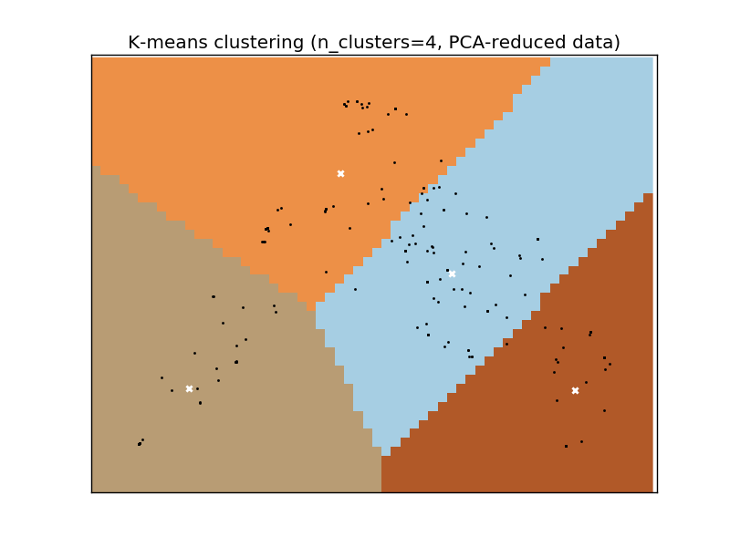

**Run script `extract_samples.sh` to unpack samples correctly**

**Tested with python3**

# GSoC CuckooML proposal

So we're given 199 malware reports to start warming up for the real challenge. Since the amount of samples is pretty low, I'll focus on an unsupervised learning method and see if something interesting comes out of it.

Making use of the scientific method, I'll start by formulating hypotheses and see if it holds for the given samples. My first hypothesis is that **malware behaves differently from *regular* software**. My second hypothesis is that **malware will behave differently depending on its purpose**.

Before going any deeper on the hypotheses, I'll try to get a better understanding of the samples, specifically:
- [x] ~~Report's structure~~
- [x] ~~Type of samples~~

## Report's structure
- target -- [Metadata about the analyzed file](https://github.com/cuckoosandbox/cuckoo/blob/master/modules/processing/targetinfo.py)
- virustotal -- [Checks for a signature match on virustotal.com (meaning it's not uploaded to virustotal)](https://github.com/cuckoosandbox/cuckoo/blob/master/modules/processing/virustotal.py)
- debug -- [Debug info, for humans](https://github.com/cuckoosandbox/cuckoo/blob/master/modules/processing/debug.py)
- signatures -- [Predefined patterns that might represent a malicious behavior](http://docs.cuckoosandbox.org/en/latest/customization/signatures/)
- buffer -- [Metadata from buffers Cuckoo considered *interesting*](https://github.com/cuckoosandbox/cuckoo/blob/master/modules/processing/buffer.py)
- network -- [Network analysis](https://github.com/cuckoosandbox/cuckoo/blob/master/modules/processing/network.py)
- strings -- [Result of `strings` on file](https://github.com/cuckoosandbox/cuckoo/blob/master/modules/processing/strings.py)
- info -- [Cuckoo metadata](https://github.com/cuckoosandbox/cuckoo/blob/master/modules/processing/analysisinfo.py)
- behavior -- [Result of dynamic analysis](https://github.com/cuckoosandbox/cuckoo/blob/master/modules/processing/behavior.py)
- static -- [Result of static analysis](https://github.com/cuckoosandbox/cuckoo/blob/master/modules/processing/static.py)
- dropped -- [Files created by the malware and Cuckoo](https://github.com/cuckoosandbox/cuckoo/blob/master/modules/processing/dropped.py)

More info in [Processing Modules](http://docs.cuckoosandbox.org/en/latest/customization/processing/).

Based on the structure, the information given by each section and focusing on the results of dynamic analysis, the sections I'll focus on will be: `target`, `virustotal`, `behavior` and `signatures`.

## Type of samples

With better understanding on how the reports are structured, let's now look at the actual data provided. The following shows how many samples provide each section:

<pre>
<b>behavior appears in 198 samples (99.50%)
signatures appears in 191 samples (95.98%)</b>
info appears in 199 samples (100.00%)
network appears in 199 samples (100.00%)
static appears in 160 samples (80.40%)
<b>target appears in 199 samples (100.00%)
virustotal appears in 171 samples (85.93%)</b>
dropped appears in 137 samples (68.84%)
strings appears in 199 samples (100.00%)
buffer appears in 58 samples (29.15%)
debug appears in 199 samples (100.00%)
</pre>

To better understand the composition of `behavior` (only `apistats`), `signatures` and  `virustotal` sections, I made a small parser to get all unique values in each section:

###`behavior` (`apistats`)
```
Number of unique apicalls: 245
Ten most common calls:
[('NtClose', 458), ('LdrGetProcedureAddress', 458), ('NtAllocateVirtualMemory', 451), ('LdrGetDllHandle', 439), ('LdrLoadDll', 436), ('NtFreeVirtualMemory', 426), ('RegCloseKey', 413), ('NtCreateFile', 405), ('RegOpenKeyExW', 390), ('NtUnmapViewOfSection', 390)]
```
###`signatures`
```
Number of unique signatures: 61
Ten most common signatures:
[('antivirus_virustotal', 167), ('raises_exception', 142), ('allocates_rwx', 137), ('creates_exe', 59), ('dumped_buffer', 58), ('antisandbox_productid', 53), ('pe_features', 49), ('recon_fingerprint', 45), ('network_http', 44), ('injection_runpe', 44)]
```
###`virustotal`
```
Number of unique families: 1054
Ten most common families:
[('Genetic', 61), ('Artemis', 41), ('Rakhni', 38), ('Delf', 26), ('GenericKD', 26), ('Betabot', 23), ('DownLoader14', 23), ('Zbot', 22), ('Kazy', 22), ('Fsysna', 21)]
```

With a better notion on what the samples provide, it's time to try some clustering.
All the previous observations can be replicated by running [`analyze_report.py`](analyze_report.py)

## Hypothesis 2 - malware will behave differently depending on its purpose
Due to the amount of signatures in the samples, I suspect that there isn't enough data to test hypothesis 1, hence I'll skip it.

In order to test hypothesis 2, I'll start by extracting features from the reports. From all the available information, the one that seems more relevant is the api calls shown in the reports (`apistats`).

The file [`extract_apistats.py`](extract_apistats.py) creates a file in [`apistats/`](apistats/) for each sample with only the api calls (order may not be the same).

In order to apply a simple clustering, I need to convert the calls into a vector, in order to do so, I used [tf-idf](https://en.wikipedia.org/wiki/Tf%E2%80%93idf). A simple term frequency is not good enough due to calls like `NtClose` that appear very frequently but aren't as meaningful as others with little frequency.

In file [`clustering.py`](clustering.py) the tf-idf and K-Means is applied with different clusters (from 2 to 9). It's worth noting that [PCA](https://en.wikipedia.org/wiki/Principal_component_analysis) is applied in order to transform the big tf-idf vector into its principal components, this is mainly done to faciliate plotting. The plotting results can be seen in the following images, where black dots represent samples and white crosses the cluster center:





